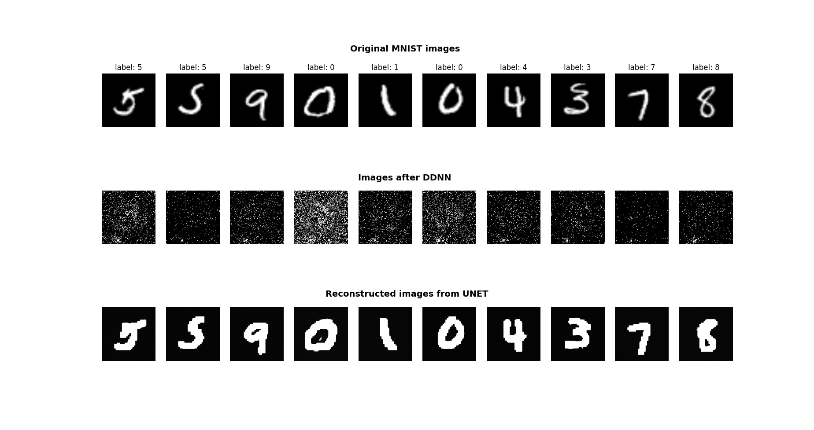

# Image Reconstruction from Deep Diffractive Neural Network 
Tamar Sde Chen and Iggy Segev Gal, Technion, 2023
Supervised by Matan Kleiner

## Abstract
In this project we will present research in the field of deep learning and image reconstruction.
The goal of the project was to understand whether it is possible to recover an image from a noise image passed through a deep optical network.
First we reproduced an Optical Network based on the article [To image, or not to image: Class-specific diffractive cameras with all-optical erasure of undesired objects](https://arxiv.org/abs/2205.13122) that demonstrates the use of a deep optical network as a classifying camera which transfers the image of the target class in high quality and for the other classes transfers a noise image.
In the second step, we recovered the original images from the noise images.
At the stage of reproducing the article, we built a model from free space propagation layers and phase mask layers, from which the model is composed in the article.
Next, we trained the network on the "MNIST" dataset and got similar results to the results of the article in the simulation of the optical network.
In the reconstruction phase, we wrote an algorithm which classifies the noise images into the original classes and we reached an average accuracy of 91.77% on 900 samples.
These results were a proof of feasibility that there is indeed information in the noise images. Last, we used a DNN with U-Net architecture.
This architecture consists of an encoder-decoder structure with skip connections.
We trained the network for image-to-image translation task.
The goal was to reconstruct the original images from the all optically erased noise like images, and we got seemingly good results.

## Description
This repository contains the implementation of:
* Recreation of a camera design that performs class-specific all-optical imaging
* Algorithm for Classification of MNIST labels from all-optical erasure of undesired objects classes.
* U-net architecture for Image-To-Image Translation task, that reconstructs the all-optically erased digits to the original MNIST digits

## Results

[//]: # (## Prerequisites)

[//]: # (| Library       | Version |)

[//]: # (|---------------|----|)

[//]: # (| `Python`      |  |)

[//]: # (| `torch`       | |)

[//]: # (| `torchvision` |  |)

[//]: # (| `numpy`       |  |)

[//]: # (| `matplotlib`  | |)

[//]: # (| `pandas `      ||)

## Files in the repository

| File name                                                     | Purpsoe                                                                                                                                                                                             |
|---------------------------------------------------------------|-----------------------------------------------------------------------------------------------------------------------------------------------------------------------------------------------------|
| `optic_network.py`                                            | Optical Model implementation. Based on the artical [To image, or not to image: Class-specific diffractive cameras with all-optical erasure of undesired objects](https://arxiv.org/abs/2205.13122)] |
| `train.py  `                                                  | Code for training the Optical Model                                                                                                                                                                 |
| `test.py`                                                     | Code for testing the trained Optical Model                                                                                                                      |
| `inverse_reconstruction.py`                                   | This code applies the inverse impulse response to the optically erased images                                                                                                                       |
| `best_match.py`                                               | Algorithm to classify the detracted images                                                                                                                                                          |
| `UNET.py`                                                     | U-Net architecture for Image-To-Image Translation task                                                                                                                                              |
| `pipe_optic_unet.py`                                          | Code for training the U-Net on the all-optical erased MNIST digits (Optical Network output), the groung truth are the original MNIST digit (before all-optical erasure)                            |
| `test_small_UNET`                                             | Code for testing the trained U-Net that reconstructs the all-optical erased MNIST digits                                                                                                               |
                                                                                                                                                    

## Data
We used MNIST dataset from torchvision Dataset class for training the Optical Model

## Models
* The implementation of the Optical Model was based on this article [To image, or not to image: Class-specific diffractive cameras with all-optical erasure of undesired objects](https://arxiv.org/abs/2205.13122).
* The implementation of the U-net was based on an existing code from: [code](https://github.com/nikhilroxtomar/Semantic-Segmentation-Architecture/blob/main/PyTorch/unet.py) and changed it for Image-To-Image task.

## Acknowledgments
Big thanks to our supervisor Matan Kleiner who gave us the opportunity to undertake the project and supported us all along the way.

