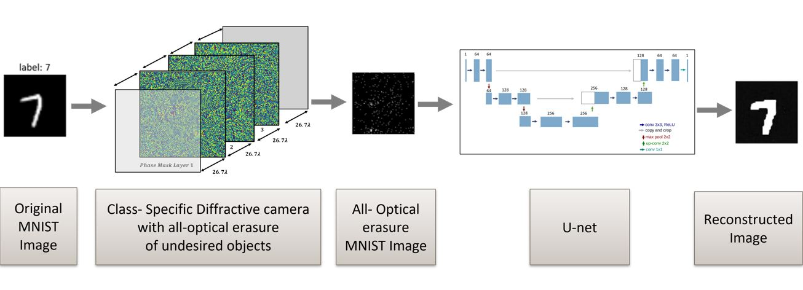

# Image Reconstruction from Deep Diffractive Neural Network 
Tamar Sde Chen and Iggy Segev Gal, Technion, 2023
Supervised by Matan Kleiner

## Abstract
Deep diffractive neural networks [1] have emerged as a promising framework that combines the speed and energy efficiency of optical computing with the power of deep learning. This has opened up new possibilities for optical computing suit for machine learning tasks and all-optical sensors. One proposed application of this framework is the design of a diffractive camera that preserves privacy by only imaging target classes while optically erasing all other unwanted classes [2]. In this project, we investigated whether this camera design truly erases the information in unwanted class data. After reproducing the results described in [2] we used K-NN to achieve up to 94% accuracy in classifying optically erased images. We then used a U-Net [3] to reconstruct the original images from their optically erased counterparts. Our findings revealed that the proposed optical diffractive camera failed to erase important information, suggesting that a different approach may be needed to achieve a truly privacy-preserving diffractive camera.



## Results


The diffraction camera architecture. 


Reconstruction of optically erased images using U-Net architecture. From top to bottom, the original MNIST images which are input to the optical network, results of a forward pass through the optical network where all of the different images are optically erased, reconstruction results of optically erased images. 


## Description
This repository contains:
* Implementation of a camera design that performs class-specific all-optical imaging, as described in [2].
* Algorithm for classification of all-optical erased MNIST digits.
* U-net architecture [3] that reconstructs all-optically erased digits to the original MNIST digits.


[//]: # (## Prerequisites)

[//]: # (| Library       | Version |)

[//]: # (|---------------|----|)

[//]: # (| `Python`      |  |)

[//]: # (| `torch`       | |)

[//]: # (| `torchvision` |  |)

[//]: # (| `numpy`       |  |)

[//]: # (| `matplotlib`  | |)

[//]: # (| `pandas `      ||)


## Repository Structure
```
├── Images - images used in this repository readme.md file   
├── Optic Network - Implementation of optical network described in [2]
├── UNET - U-Net architecture [3] for Image-to-Image translation
└── classification_algorithm - Classification algorithm for erased MNIST digits 
```

## References

[1] Lin, X., Rivenson, Y., Yardimci, N.T., Veli, M., Luo, Y., Jarrahi, M. and Ozcan, A., 2018. [All-optical machine learning using diffractive deep neural networks.](https://www.science.org/doi/full/10.1126/science.aat8084) Science, 361(6406), pp.1004-1008.


[2] Bai, B., Luo, Y., Gan, T., Hu, J., Li, Y., Zhao, Y., Mengu, D., Jarrahi, M. and Ozcan, A., 2022. [To image, or not to image: class-specific diffractive cameras with all-optical erasure of undesired objects.](https://elight.springeropen.com/articles/10.1186/s43593-022-00021-3?via=indexdotco) eLight, 2(1), pp.1-20.


[3] Ronneberger, O., Fischer, P. and Brox, T., 2015. [U-net: Convolutional networks for biomedical image segmentation.](https://link.springer.com/chapter/10.1007/978-3-319-24574-4_28) In Medical Image Computing and Computer-Assisted Intervention–MICCAI 2015: 18th International Conference, Munich, Germany, October 5-9, 2015, Proceedings, Part III 18 (pp. 234-241). Springer International Publishing.

## Sources
* The data used in this project is the [MNIST digits dataset](https://yann.lecun.com/exdb/mnist/). 
* The implementation of the U-net was based on an [existing code](https://github.com/nikhilroxtomar/Semantic-Segmentation-Architecture/blob/main/PyTorch/unet.py) which we changed for Image-to-Image translation task.


## Acknowledgments
Big thanks to our supervisor Matan Kleiner who gave us the opportunity to undertake the project and supported us all along the way.
